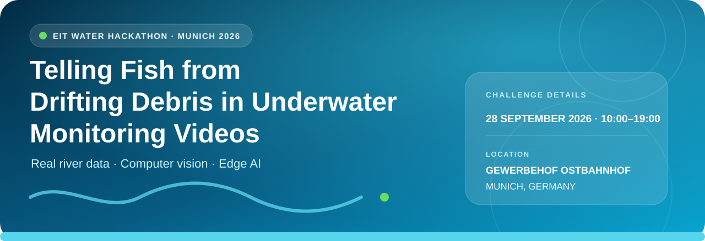
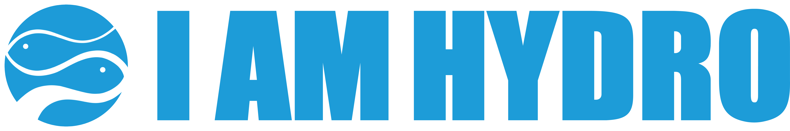
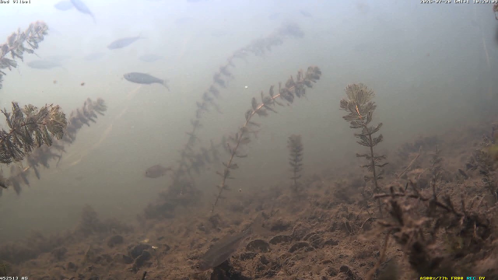
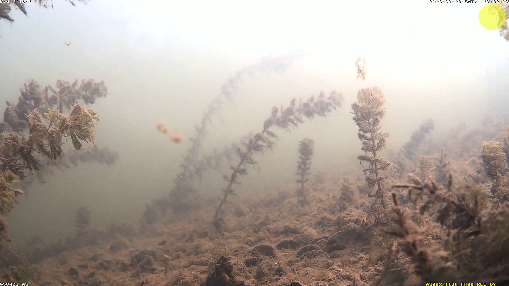
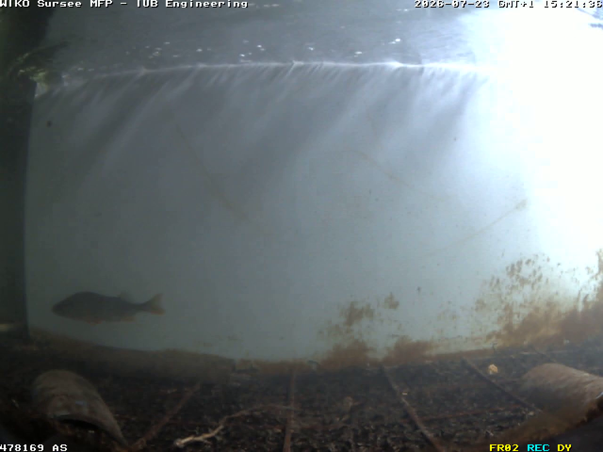
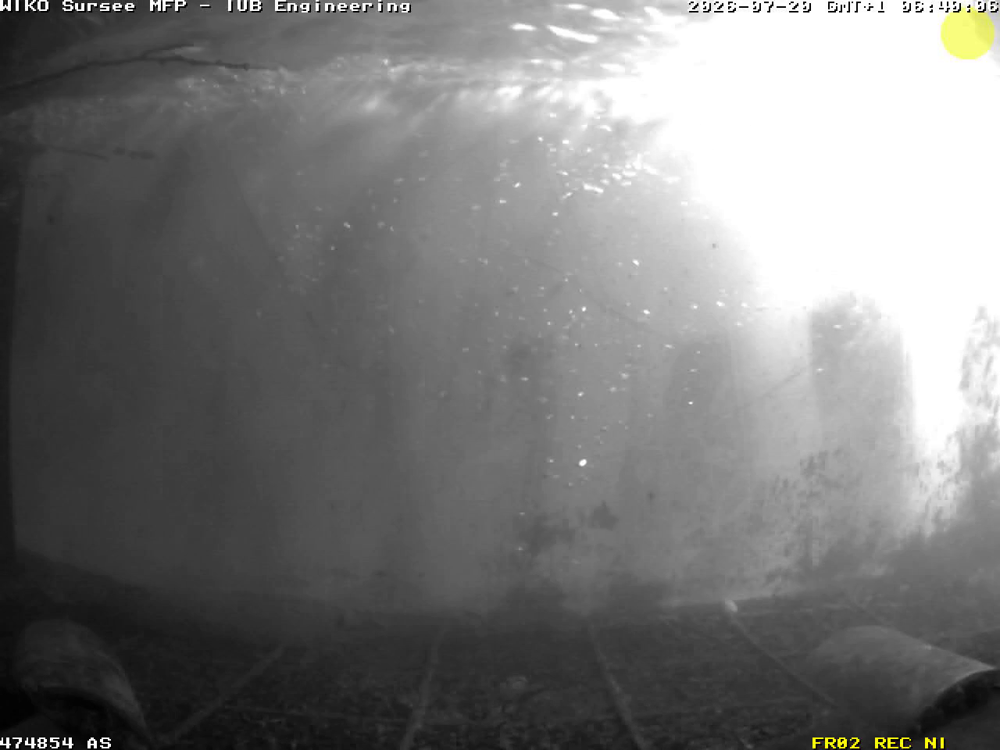

<p align="center">
  
</p>

<p align="center">
  <a href="https://iamhydro.com/"></a>
  &nbsp;&nbsp;&nbsp;&nbsp;
  <a href="https://taltech.ee/en"></a>
</p>

<p align="center"><sub>Challenge owners: I AM HYDRO and Tallinn University of Technology (TalTech)</sub></p>

<p align="center">
  <strong>Can your AI find the fish without chasing every leaf?</strong><br>
  An open computer-vision challenge for real-world river monitoring.
</p>

<p align="center">
  <a href="https://www.deep-ecosystems.com/eit-water-hackathon-munich-2026"></a>
  
  <a href="DATA_LICENSE.md"></a>
  <a href="LICENSE"></a>
</p>

<p align="center">
  <a href="https://livettu-my.sharepoint.com/:f:/g/personal/jetuht_taltech_ee/IgD0VZa1wK0YTpnOH-FoSc7tAdqcC-dW5Tcx4iYphl73uhk"><strong>⬇️ Download dataset</strong></a>
  &nbsp;•&nbsp;
  <a href="CHALLENGE_GUIDE.md"><strong>🚀 Start building</strong></a>
  &nbsp;•&nbsp;
  <a href="SCORING.md"><strong>🏆 See the scoring</strong></a>
  &nbsp;•&nbsp;
  <a href="SUBMISSION_TEMPLATE.md"><strong>📦 Prepare submission</strong></a>
</p>

---

## 01 — The challenge

Underwater cameras help show whether fish passages at hydropower plants and
river barriers really work. The cameras run continuously—but leaves, twigs,
bubbles, sediment, glare, and moving plants can all look like fish to a motion
detector.

That can create thousands of false events per station, per day.

> **Your challenge:** build a small proof of concept that finds real fish,
> rejects drifting debris and noise, and can run efficiently near the camera.

This challenge is brought by **I AM HYDRO** and **Tallinn University of
Technology (TalTech)** for the
[EIT Water HACKATHON Munich 2026](https://www.deep-ecosystems.com/eit-water-hackathon-munich-2026).

## 02 — Dataset at a glance

| 🖼️ Images | 🐟 Fish boxes | 🍂 Hard negatives | 📅 Dates | 🌗 Conditions |
| ---: | ---: | ---: | ---: | --- |
| **1,200** | **1,291** | **300** | **13** | Dawn, day, dusk, night |

| Split | Images | Fish-positive | No-fish | Fish boxes |
| --- | ---: | ---: | ---: | ---: |
| Train | 840 | 630 | 210 | 938 |
| Validation | 180 | 135 | 45 | 184 |
| Test | 180 | 135 | 45 | 169 |

The images cover multiple cameras, dates, lighting levels, water conditions,
backgrounds, and colour casts. Nearby frames stay in the same split to reduce
data leakage.

## 03 — Fish or false alarm?

These are unchanged images from the training split. Yellow circles and camera
text are part of the original recordings, not dataset labels.

| ✅ Fish | 🍂 No fish: leaf-like material |
| --- | --- |
|  |  |
| Several fish at different sizes and contrast levels. | A leaf-like object and plants, but no annotated fish. |

| ✅ Fish | 💨 No fish: particles and changing light |
| --- | --- |
|  |  |
| One fish against uneven light. | Suspended particles and glare, but no annotated fish. |

> [!IMPORTANT]
> `no_fish` is a reviewed frame-level label. The negative images are not
> annotated with separate object classes such as `leaf`, `bubble`, or `twig`.
> The captions above describe what is visible; they do not add new labels.

## 04 — Build and test

| 1. Explore 🔎 | 2. Build 🛠️ | 3. Prove 📊 | 4. Pitch 🎤 |
| --- | --- | --- | --- |
| Study fish and no-fish scenes. | Train a detector and reduce false alarms. | Test accuracy, speed, memory, and model size. | Show a working demo, a failure, and your next step. |

### Quick start

1. **[Download the complete dataset](https://livettu-my.sharepoint.com/:f:/g/personal/jetuht_taltech_ee/IgD0VZa1wK0YTpnOH-FoSc7tAdqcC-dW5Tcx4iYphl73uhk).**
   The public read-only link needs no sign-in and is valid through **13 March
   2027** under TalTech's anonymous-link policy.
2. Check the downloaded files against `metadata/SHA256SUMS`.
3. Read the [participant guide](CHALLENGE_GUIDE.md).
4. Train with `train` and choose settings with `validation`.
5. Freeze your system before the final `test` run.
6. Report results using the [submission template](SUBMISSION_TEMPLATE.md).

Install the tools in this repository when you are ready to validate or score
results:

```bash
git clone https://github.com/jtuhtan/taltech-fish-debris-hackathon.git
cd taltech-fish-debris-hackathon
python -m pip install -r requirements.txt
```

## 05 — What should you build?

Create a model or application that takes an underwater image and returns a
bounding box and confidence score for each fish. A no-fish image should
normally return no boxes.

Your proof of concept can be a:

- notebook or training experiment;
- command-line inference tool;
- small web or desktop demo;
- model optimised for an edge device; or
- useful combination of detection, filtering, and event review.

The judges must be able to run or inspect the result. Pretrained models and
outside data are allowed when clearly declared.

## 06 — How judging works

Every eligible entry is scored out of **100 points**.

| Area | Points | Main question |
| --- | ---: | --- |
| 🎯 Model performance | **60** | Does it find fish and reject false alarms? |
| ⚡ Edge readiness | **15** | Is it fast, small, and practical near a camera? |
| 🔁 Reproducibility | **10** | Can another person run and understand it? |
| 🌍 Real-world value | **10** | Is the idea useful and feasible? |
| 🎤 Demo | **5** | Does the team show clear evidence and limitations? |

The scored model metrics include fish F2, no-fish rejection, COCO mAP50:95,
and performance across times of day. The operating point is fixed at confidence
`0.25` and IoU `0.50` so teams are compared fairly.

**[Read the full scoring formula, judging process, and tie-breaks →](SCORING.md)**

## 07 — Hackathon day

| | |
| --- | --- |
| **Event** | [EIT Water HACKATHON Munich 2026](https://www.deep-ecosystems.com/eit-water-hackathon-munich-2026) |
| **When** | 28 September 2026, 10:00–19:00 |
| **Where** | Gewerbehof Ostbahnhof, Haagerstr. 5-11, 80339 München, Germany |
| **Format** | One-day innovation sprint; working language is English |
| **Challenge owners** | I AM HYDRO and TalTech |
| **Organiser** | DEEP Ecosystems |

The goal is an early-stage proof of concept: a working experiment, mockup,
user journey, or quick feasibility check. It does not need to be a finished
commercial product.

<details>
<summary><strong>Dataset files and formats</strong></summary>

COCO, YOLO, and Fishbox annotations are included.

```text
images/{train,validation,test}/
labels/yolo/{train,validation,test}/
annotations/instances_{train,validation,test}.json
annotations/fishbox_annotations.json
metadata/manifest.csv
metadata/build_report.json
data.yaml
```

- `fish`: bounding-box annotation for a visible fish.
- `no_fish`: reviewed hard-negative frame, represented by an empty YOLO label
  file.
- Each `frame_id` starts with `f-` and uses the first 12 hexadecimal characters
  of the complete image's SHA-256 digest.
- Exported bounding boxes are clamped to the image boundary.

</details>

<details>
<summary><strong>Split and curation policy</strong></summary>

The deterministic 70/15/15 split groups images by capture source and 10-minute
time window. Adjacent frames therefore do not cross splits. Selection covers
project, deployment, date, time band, and coarse visual-condition groups.

See `metadata/build_report.json` for exact counts and
`metadata/selection_manifest.csv` for one auditable row per image.

</details>

<details>
<summary><strong>Responsible use and limitations</strong></summary>

This dataset is for research, education, benchmarking, and prototype
development. It comes from a limited number of camera deployments and does not
represent every river, species, season, camera, or flow condition. A strong
benchmark result still needs site-specific testing before operational use.

See the [dataset card](DATASET_CARD.md) for more detail.

</details>

## 08 — Open data, open ideas

The images and annotations are released under
[Creative Commons Attribution 4.0](DATA_LICENSE.md). The supporting code is
released under the [MIT License](LICENSE).

If you improve the documentation or tools, contributions are welcome—see
[CONTRIBUTING.md](CONTRIBUTING.md).

<p align="center">
  <strong>Protect fish passage. Reduce false alarms. Build something that can work in the river. 🌊</strong>
</p>
