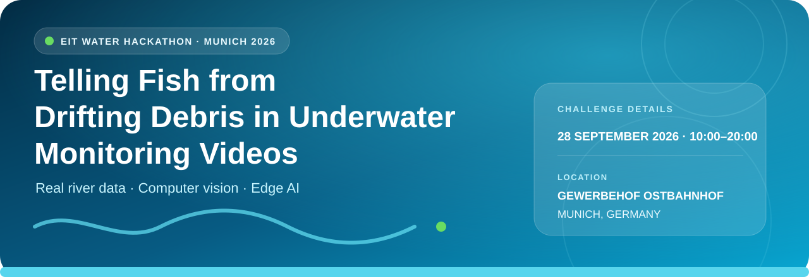
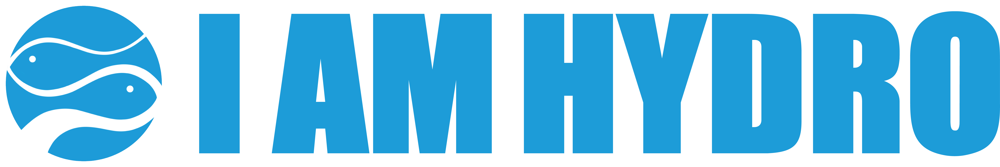
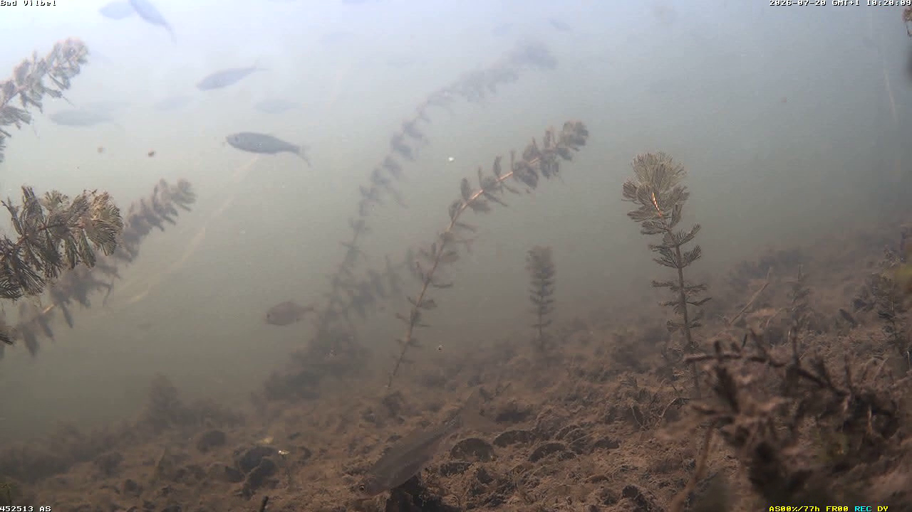
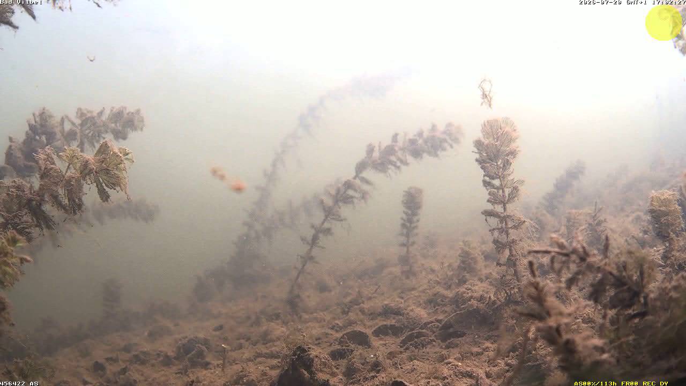
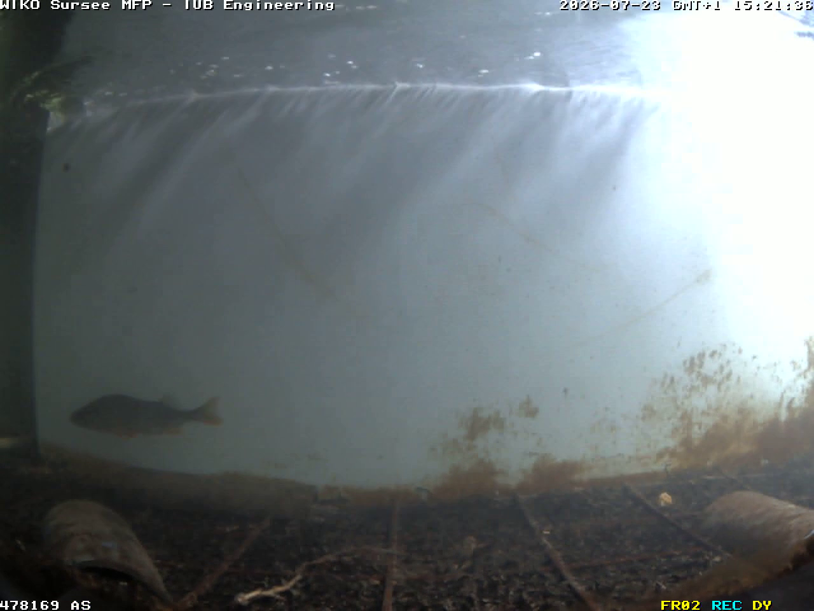
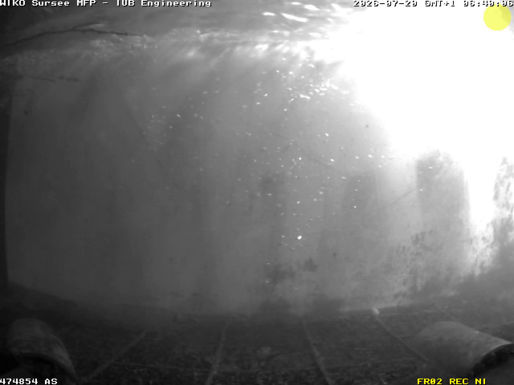
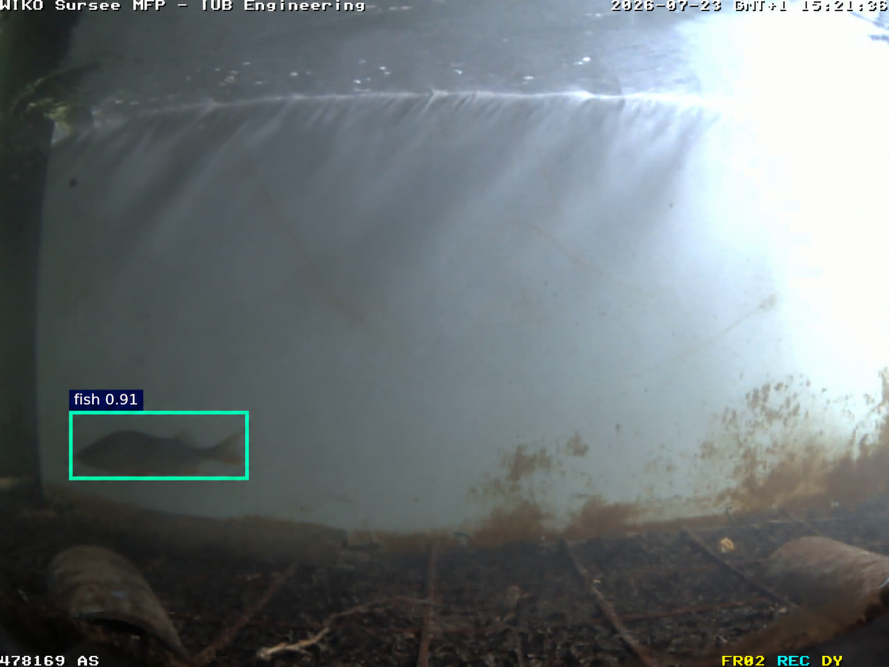

<p align="center">
  
</p>

<p align="center">
  <a href="https://iamhydro.com/"></a>
  &nbsp;&nbsp;&nbsp;&nbsp;
  <a href="https://taltech.ee/en"></a>
</p>

<p align="center"><sub>Challenge owners: I AM HYDRO and Tallinn University of Technology (TalTech)</sub></p>

<p align="center">
  <strong>Can your AI find the fish without chasing every leaf?</strong><br>
  An open computer-vision challenge for real-world river monitoring.
</p>

<p align="center">
  <a href="https://www.deep-ecosystems.com/eit-water-hackathon-munich-2026"></a>
  
  <a href="DATA_LICENSE.md"></a>
  <a href="LICENSE"></a>
</p>

<p align="center">
  <a href="https://livettu-my.sharepoint.com/:f:/g/personal/jetuht_taltech_ee/IgD0VZa1wK0YTpnOH-FoSc7tAdqcC-dW5Tcx4iYphl73uhk"><strong>⬇️ Download dataset</strong></a>
  &nbsp;•&nbsp;
  <a href="CHALLENGE_GUIDE.md"><strong>🚀 Start building</strong></a>
  &nbsp;•&nbsp;
  <a href="SCORING.md"><strong>🏆 How judging works</strong></a>
  &nbsp;•&nbsp;
  <a href="SUBMISSION_TEMPLATE.md"><strong>📦 Prepare submission</strong></a>
  &nbsp;•&nbsp;
  <a href="https://github.com/jtuhtan/taltech-fish-debris-hackathon/issues/new?template=submission.yml"><strong>📤 Submit predictions</strong></a>
</p>

---

## 01 — The challenge

Underwater cameras help show whether fish passages at hydropower plants and
river barriers really work. The cameras run continuously—but leaves, twigs,
bubbles, sediment, glare, and moving plants can all look like fish to a motion
detector.

That can create thousands of false events per station, per day.

> **Your challenge:** build a small proof of concept that finds real fish,
> rejects drifting debris and noise, and can run efficiently near the camera.
> Then show why it matters for rivers and how it could work as a real service.

This challenge is brought by **I AM HYDRO** and **Tallinn University of
Technology (TalTech)** for the
[EIT Water HACKATHON Munich 2026](https://www.deep-ecosystems.com/eit-water-hackathon-munich-2026).

## 02 — How you'll be judged

The overall ranking uses the official **DEEP judging criteria** for the EIT
Water Hackathon Munich 2026. All four categories count.

| DEEP category | Points | Judges ask | Show us |
| --- | ---: | --- | --- |
| 🌍 **Strategic Alignment & Climate Impact** | **25** | Does it help protect fish and rivers, even in floods and high flow? | Results on your hardest frames, and how it helps prove that fish passes work (EU Water Framework Directive) |
| 🛠️ **Innovation & Technical Feasibility** | **25** | Does it work near the camera, and can others reproduce it? | Our benchmark: model performance, edge readiness, and reproducibility |
| 📈 **Business-Readiness & Scalability** | **30** | Who uses it, how much review time does it save, and how does it scale? | Review hours saved per station, and an operating model for many sites |
| 🎤 **Team Capabilities & Pitch Quality** | **20** | Can the team show it working and take it further? | A working demo, a fish and a no-fish case, one failure, and your next step |

> [!TIP]
> A strong model alone covers only part of category 2. Business readiness and
> the pitch together are half of the points, so keep time for them.

**[Read what judges look for in each category →](SCORING.md)**

## 03 — Dataset at a glance

| 🖼️ Images | 🐟 Fish boxes | 🍂 Hard negatives | 📅 Dates | 🌗 Conditions |
| ---: | ---: | ---: | ---: | --- |
| **1,200** | **1,291** | **300** | **13** | Dawn, day, dusk, night |

| Split | Images | Fish-positive | No-fish | Fish boxes |
| --- | ---: | ---: | ---: | ---: |
| Train | 840 | 630 | 210 | 938 |
| Validation | 180 | 135 | 45 | 184 |
| Test | 180 | 135 | 45 | 169 |

The images cover multiple cameras, dates, lighting levels, water conditions,
backgrounds, and colour casts. Nearby frames stay in the same split to reduce
data leakage.

## 04 — Fish or false alarm?

These are unchanged images from the training split. Yellow circles and camera
text are part of the original recordings, not dataset labels.

| ✅ Fish | 🍂 No fish: leaf-like material |
| --- | --- |
|  |  |
| Several fish at different sizes and contrast levels. | A leaf-like object and plants, but no annotated fish. |

| ✅ Fish | 💨 No fish: particles and changing light |
| --- | --- |
|  |  |
| One fish against uneven light. | Suspended particles and glare, but no annotated fish. |

> [!IMPORTANT]
> `no_fish` is a reviewed frame-level label. The negative images are not
> annotated with separate object classes such as `leaf`, `bubble`, or `twig`.
> The captions above describe what is visible; they do not add new labels.

## 05 — Your path through the day

Plan your work around the four categories. A simple baseline early leaves
time for the rest.

| 🌍 1. Understand the impact | 🛠️ 2. Build and measure | 📈 3. Make the business case | 🎤 4. Pitch |
| --- | --- | --- | --- |
| Study fish and no-fish scenes, and the hardest conditions: night, low contrast, and debris. | Train a detector, reduce false alarms, and measure accuracy, speed, memory, and size. | Estimate review hours saved and decide how the system would run at many sites. | Show a working demo, a failure, the impact, the business case, and your next step. |

### Quick start

1. **[Download the complete dataset](https://livettu-my.sharepoint.com/:f:/g/personal/jetuht_taltech_ee/IgD0VZa1wK0YTpnOH-FoSc7tAdqcC-dW5Tcx4iYphl73uhk).**
   The public read-only link needs no sign-in and is valid through **13 March
   2027** under TalTech's anonymous-link policy.
2. Check the downloaded files against `metadata/SHA256SUMS`.
3. Read the [participant guide](CHALLENGE_GUIDE.md).
4. Train with `train` and choose settings with `validation`.
5. Freeze your system before the final `test` run.
6. Upload your test predictions with the [submission form](https://github.com/jtuhtan/taltech-fish-debris-hackathon/issues/new?template=submission.yml).
   They are scored automatically and sent to the challenge owners for review.
   The deadline is **18:00 Munich time**, and your latest submission before
   it counts.
7. Report all four categories using the
   [submission template](SUBMISSION_TEMPLATE.md).

Install the tools in this repository when you are ready to validate or score
results:

```bash
git clone https://github.com/jtuhtan/taltech-fish-debris-hackathon.git
cd taltech-fish-debris-hackathon
python -m pip install -r requirements.txt
```

## 06 — What to deliver

Your proof of concept has four parts, one for each category:

1. 🌍 **Impact:** how your system helps protect fish and rivers, and how it
   behaves in the hardest conditions.
2. 🛠️ **A working detector:** a model or application, measured with our
   [benchmark](BENCHMARK.md).
3. 📈 **A business case:** target users, review hours saved, and an operating
   model.
4. 🎤 **A demo and pitch:** a working demo and a clear story, backed by your
   [submission report](SUBMISSION_TEMPLATE.md).

### The detector

Create a model or application that takes an underwater image and returns a
bounding box and confidence score for each fish. A no-fish image should
normally return no boxes. Predictions are scored at a fixed operating point,
confidence `0.25` and IoU `0.50`, so teams are compared fairly.

#### Two example outputs

| Fish input | No-fish input |
| --- | --- |
|  |  |
| **Expected:** one fish prediction. The ground-truth COCO box is `[102.057, 606.313, 252.548, 89.908]`. | **Expected:** no predictions, represented as `[]`. |
| `[{"bbox": [102.057, 606.313, 252.548, 89.908], "score": 0.91}]` | `[]` |

COCO boxes use `[x, y, width, height]` in pixels. The example score `0.91` is
only illustrative: participants' models must produce their own confidence
scores. The dataset provides the ground-truth box, not a model confidence. The
overlay is a presentation example; the original dataset image remains
unchanged.

The detector can be a:

- notebook or training experiment;
- command-line inference tool;
- small web or desktop demo;
- model optimised for an edge device; or
- useful combination of detection, filtering, and event review.

The judges must be able to run or inspect the result. Pretrained models and
outside data are allowed when clearly declared.

## 07 — Hackathon day

| | |
| --- | --- |
| **Event** | [EIT Water HACKATHON Munich 2026](https://www.deep-ecosystems.com/eit-water-hackathon-munich-2026) |
| **When** | 28 September 2026, 10:00–20:00 |
| **Submission deadline** | 18:00 Munich time, when the final pitches start |
| **Where** | Gewerbehof Ostbahnhof, Haagerstr. 5-11, 80339 München, Germany |
| **Format** | One-day innovation sprint; working language is English |
| **Challenge owners** | I AM HYDRO and TalTech |
| **Organiser** | DEEP Ecosystems |

| Time | Programme |
| --- | --- |
| 10:00–10:30 | Registration, coffee, and networking |
| 10:30–10:50 | Welcome and framing by EIT Water and DEEP Ecosystems |
| 10:50–11:15 | Challenge introduction and lightning talks |
| 11:15–11:45 | Team formation and challenge selection |
| 11:45–13:30 | Hack sprint I: problem framing, user journeys, first concepts |
| 13:30–14:15 | Lunch and informal mentoring |
| 14:15–16:15 | Hack sprint II: proof-of-concept design, feasibility, impact, and business logic |
| 16:15–17:00 | Pitch coaching and pitch deck finalisation |
| 17:00–18:00 | Tech check and pitch dry-runs |
| **18:00** | **Submission deadline** |
| 18:00–20:00 | Final pitches, jury decision, and award ceremony |

See the [official event page](https://www.deep-ecosystems.com/eit-water-hackathon-munich-2026)
for any programme changes.

The goal is an early-stage proof of concept: a working experiment, mockup,
user journey, or quick feasibility check. It does not need to be a finished
commercial product, but judges look for a credible path to real use.

<details>
<summary><strong>Dataset files and formats</strong></summary>

COCO, YOLO, and Fishbox annotations are included.

```text
images/{train,validation,test}/
labels/yolo/{train,validation,test}/
annotations/instances_{train,validation,test}.json
annotations/fishbox_annotations.json
metadata/manifest.csv
metadata/build_report.json
data.yaml
```

- `fish`: bounding-box annotation for a visible fish.
- `no_fish`: reviewed hard-negative frame, represented by an empty YOLO label
  file.
- Each `frame_id` starts with `f-` and uses the first 12 hexadecimal characters
  of the complete image's SHA-256 digest.
- Exported bounding boxes are clamped to the image boundary.

</details>

<details>
<summary><strong>Split and curation policy</strong></summary>

The deterministic 70/15/15 split groups images by capture source and 10-minute
time window. Adjacent frames therefore do not cross splits. Selection covers
project, deployment, date, time band, and coarse visual-condition groups.

See `metadata/build_report.json` for exact counts and
`metadata/selection_manifest.csv` for one auditable row per image.

</details>

<details>
<summary><strong>Responsible use and limitations</strong></summary>

This dataset is for research, education, benchmarking, and prototype
development. It comes from a limited number of camera deployments and does not
represent every river, species, season, camera, or flow condition. A strong
benchmark result still needs site-specific testing before operational use.

See the [dataset card](DATASET_CARD.md) for more detail.

</details>

## 08 — Open data, open ideas

The images and annotations are released under
[Creative Commons Attribution 4.0](DATA_LICENSE.md). The supporting code is
released under the [MIT License](LICENSE).

If you improve the documentation or tools, contributions are welcome—see
[CONTRIBUTING.md](CONTRIBUTING.md).

<p align="center">
  <strong>Protect fish passage. Reduce false alarms. Build something that can work in the river. 🌊</strong>
</p>
